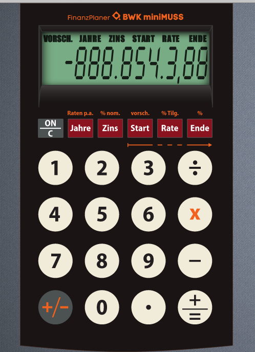

% Habits
% John Doe
% March 22, 2005

# In the morning

Was hier steht ist nicht zu sehen, wenn --slide-level 2

auch keine Speakernotes

## Getting up

- Turn off alarm
- Get out of bed

This is my note.

- It can contain markdown
- like this list

## Breakfast

- Eat eggs
- Drink coffee

# In the evening
## Dinner

- Eat spaghetti
- Drink wine

------------------

------------------

What shall we do with drunken sailor?

. . .

Was mache mer nu?

## Going to sleep

- Get in bed
- Count sheep

